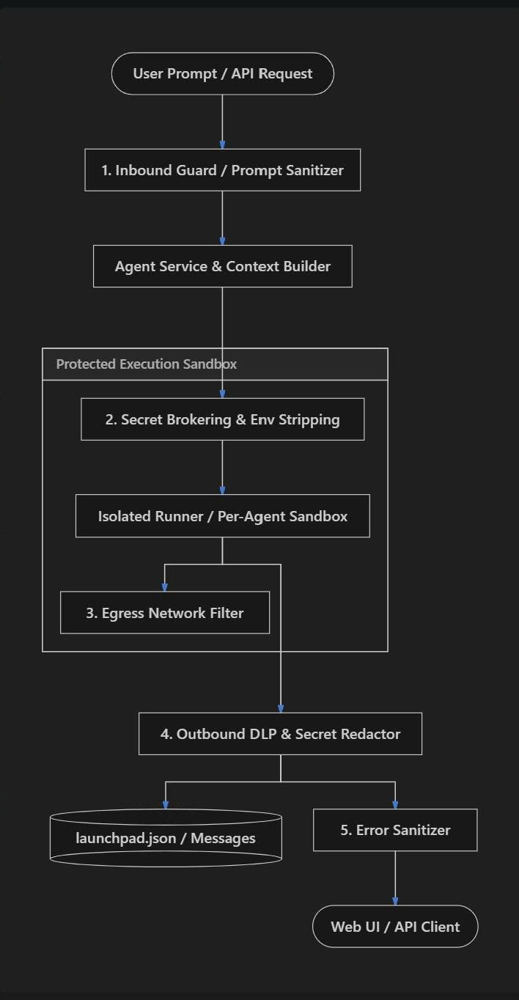

#### Key Defensive Capabilities to Implement:
1. **Outbound DLP & Secret Redaction (Data Loss Prevention)**:
   - Scans tool execution output and LLM responses before storage or API return.
   - Automatically masks API keys (`ARK_API_KEY`, Bearer tokens, AWS/Volcengine AK/SK), private keys, passwords, and sensitive regex patterns (`sk-[a-zA-Z0-9]{20,}`, `ep-[a-zA-Z0-9-]{10,}`, JWT tokens).
2. **Environment & Sandbox Isolation Middleware**:
   - Per-agent isolated `CODEX_HOME` directories (e.g. `codex-home/<agent-id>`) so agents cannot read peer session files.
   - Stripping sensitive environment variables (`ARK_API_KEY`) from tool execution contexts, utilizing reverse-proxy or local credential brokering where feasible.
3. **Egress Network Filtering / Policy**:
   - Disabling default internet egress or restricting outbound connections to required package mirrors/Ark endpoints only, preventing prompt-injected data exfiltration.
4. **Input Prompt Sanitization & Anti-Extraction Guardrails**:
   - Detecting prompt injection attempts aimed at system prompt extraction or secret harvesting.
5. **Path & Error Sanitization**:
   - Masking absolute host paths in API payloads to relative workspace aliases (e.g. `~/workspace`).
   - Normalizing and scrubbing server error messages to generic error codes before returning to the client.

   